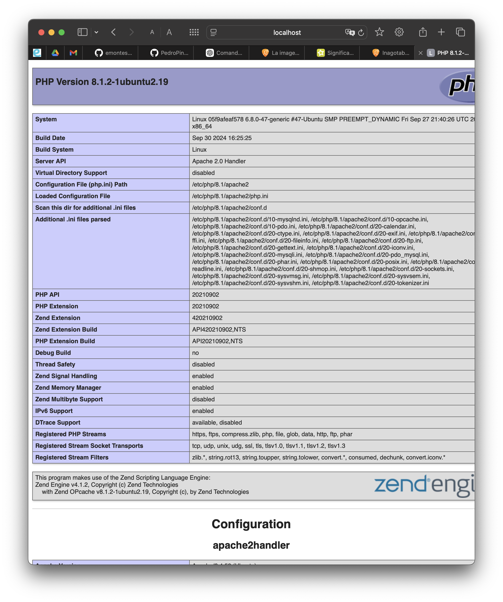
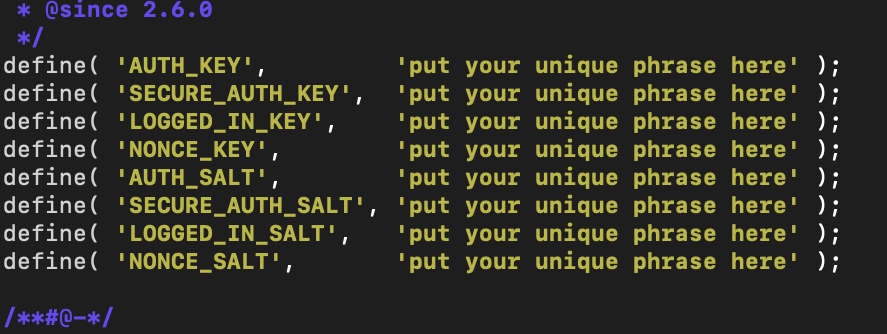
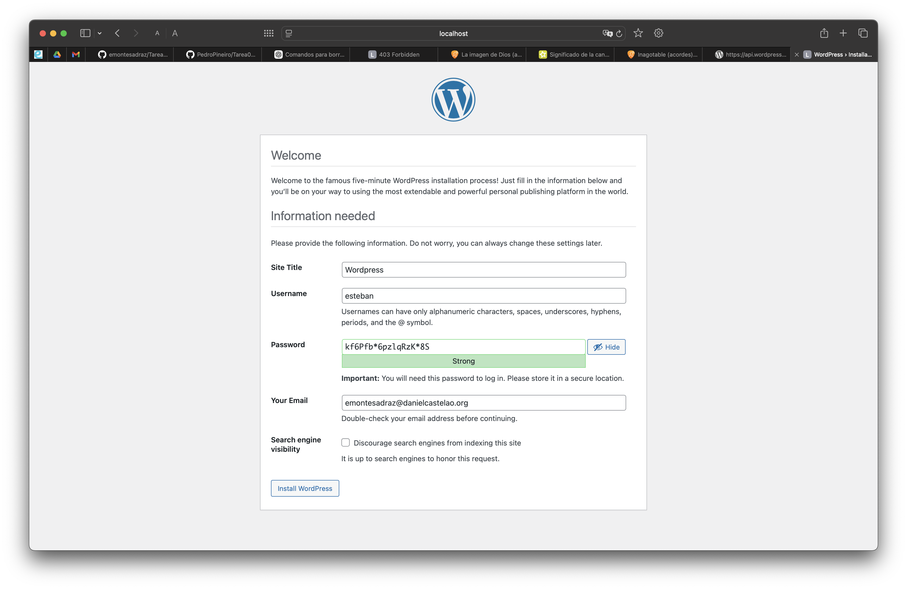
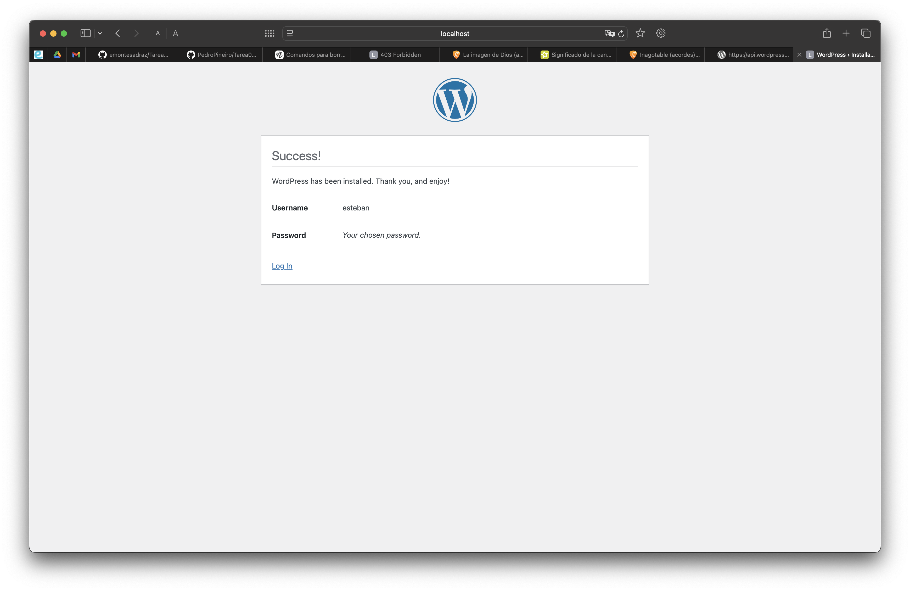
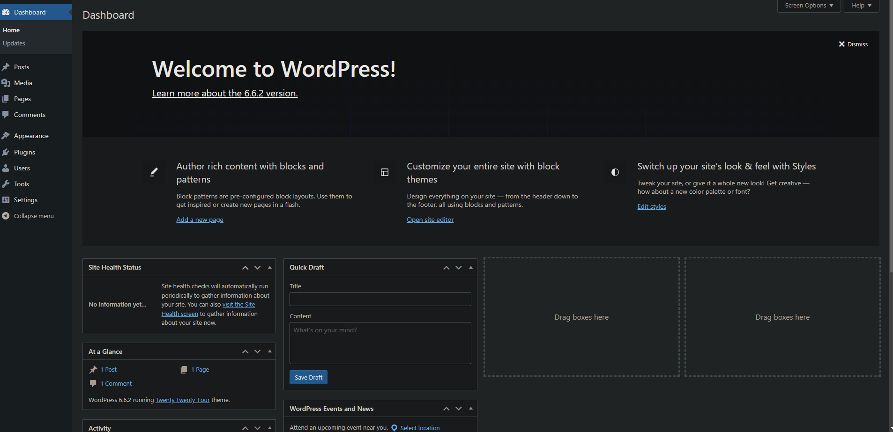

# Tarea 4
*Esteban Miguel Montes Adraz* - *2 DAM* - *SXE*

--- 

## 1. Utiliza la imagen de Ubuntu , tag 22 y apoyandote en esta guía sigue sus instrucciones para instalar LAMP en dicho contenedor.

Para empezar, nos descargaremos la imagen de Ubuntu de esta manera:
```
docker pull ubuntu:22.04
```

Después de descargarlo creamos un contenedor y ya accederemos a él:
```
docker run -it --name ubuntu-lamp -p 8080:80 ubuntu:22.04 bash
```

Nos debería aparecer esto:


---
---


Ahora vamos a instalar Apache, PHP y MySQL dentro del contenedor

* Primero actualizaremos los paquetes e instalaremos Apache
```bash
apt update 

apt install -y apache2 apache2-utils
```

* Ahora instalaremos MySQL, lo iniciaremos y lo iniciaremos:
``` bash
apt install -y mariadb-server mariadb-client

service mariadb start

mysql_secure_installation
```
* Luego de ejecutar este comando, tendremos que contestar las preguntas de esta manera


* Por último, instalaremos PHP
```
apt install php libapache2-mod-php php-mysql -y
```
En la instalación nos pedirá que introduzcamos nuestra área geográfica y nuestro huso horario, tal como indica en la foto


* Ahora miraremos que esté todo bien instalado y reiniciaremos Apache 
```
echo "<?php phpinfo(); ?>" | tee /var/www/html/info.php

service apache2 restart
```

Comprobamos que se puede ejecutar en nuestro navegador
```
http://(IP DE LA MÁQUINA)/info.php
```

## 2. Instalar wordpress en el contenedor

1. Para instalar WordPress en el contenedor, primero tendremos que instalar las dependencias. Aquí te dejo los comandos que tendrás que ejecutar:

```
apt update

apt install apache2 \ghostscript \libapache2-mod-php \mysql-server \php \php-bcmath \php-curl \php-imagick \php-intl \php-json \php-mbstring \php-mysql \php-xml \php-zip
```

2. Ahora crearemos el directorio de instalación para luego descargar el archivo desde WordPress.org. Después de todo esto lo descomprimiremos:
```
mkdir /var/www/html/
cd /var/www/html
wget https://wordpress.org/latest.tar.gz
tar -xvzf latest.tar.gz
```
* Puede que nos de un error como este:

Para solucionarlo instalamos ```wget```
```
apt install wget
```
* Ahora configuraremos Apache para WordPress

    1. Primero instalamos nano para editar el archivo
    ```
    apt update
    apt install nano
    ```
    2. Ahora vamos a crear y editar el archivo de configuración
    ```
    touch /etc/apache2/sites-available/wordpress.conf

    nano /etc/apache2/sites-available/wordpress.conf
    ```
    3. Dentro del archivo pegamos lo siguiente
    ```html
    <VirtualHost *:80>
        ServerAdmin webmaster@localhost
        DocumentRoot /var/www/html/wordpress
        ServerName wordpress.local
        ServerAlias www.wordpress.local
        <Directory /var/www/html/wordpress>
            Options FollowSymLinks
            AllowOverride All
            Require all granted
        </Directory>
        ErrorLog ${APACHE_LOG_DIR}/error.log
        CustomLog ${APACHE_LOG_DIR}/access.log combined
    </VirtualHost>
    ```
    4. Inicializamos WordPress y recargamos Apache
    ```
    a2ensite wordpress
    service apache2 reload
    ```
    5. Habilitamos la reescritura del URL y deshabilitamos sitio predeterminado
    ```
    a2enmod rewrite
    a2dissite 000-default
    ```
    6. Reiniciamos apache
    ```
    service apache2 restart
    ```

* Ahora comfiguraremos la base de datos. Entraremos con este comando
```
mysql -u root
```
* Ahora pondremos esto dentro del mysql editando el usuario y la contraseña
```sql
CREATE DATABASE wordpress;
CREATE USER 'esteban' IDENTIFIED BY '<your-password>';
GRANT SELECT, INSERT, UPDATE, DELETE, CREATE, DROP, ALTER ON wordpress.* TO 'esteban';
FLUSH PRIVILEGES;
QUIT;
```
* Para configurar WordPress para acceder a la base de datos copiamos el archivo de configuración
```
cp /var/www/html/wordpress/wp-config-sample.php /var/www/html/wordpress/wp-config.php
```
* Una vez dentro del archivo, modificaremos estas líneas


* Tambien busca lo que aparece en la imagen y lo cambias por lo que hay en este [link](https://api.wordpress.org/secret-key/1.1/salt/)


## 3. Accedemos al WordPress desde nuestro navegador
* Para acceder desde nuestro navegador, pondremos esto
```
http://localhost:8080/wp-admin/setup-config.php
```





