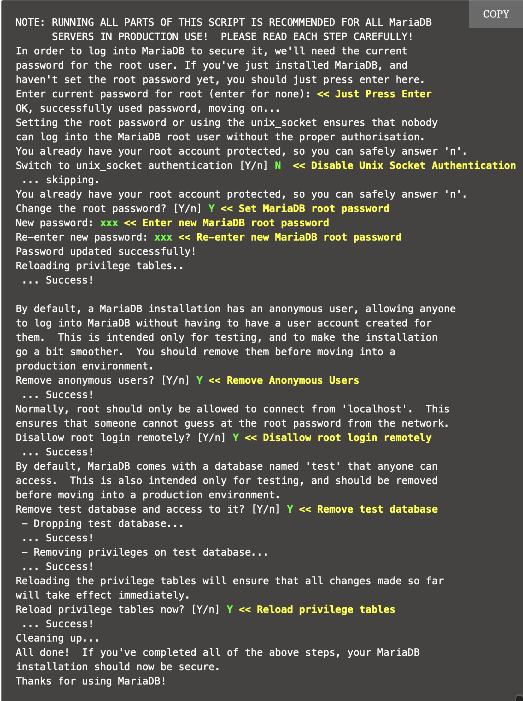
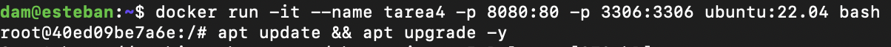
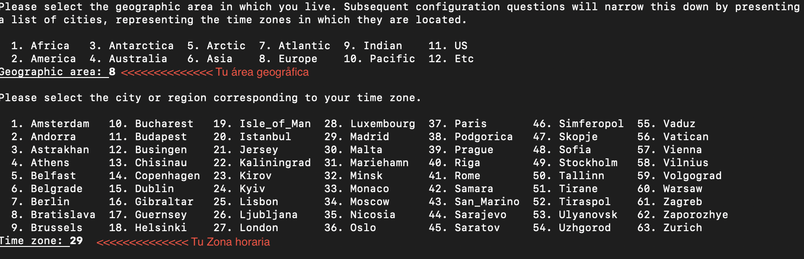
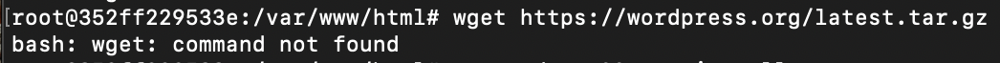
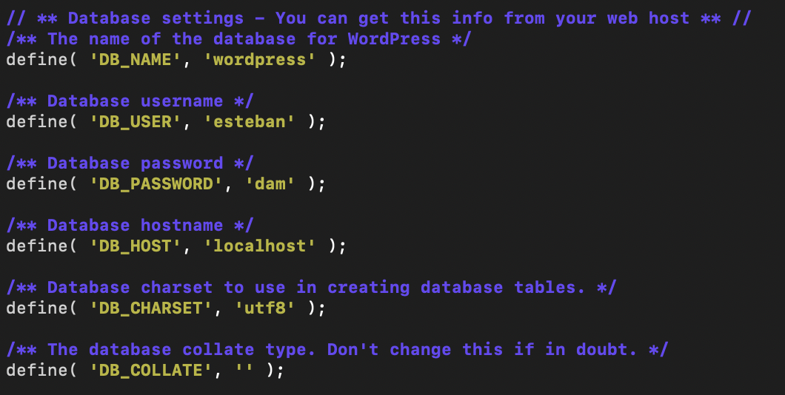

# Tarea 4
*Esteban Miguel Montes Adraz* - *2 DAM* - *SXE*

--- 

## 1. Utiliza la imagen de Ubuntu , tag 22 y apoyandote en esta guía sigue sus instrucciones para instalar LAMP en dicho contenedor.

Para descargarnos LAMP, vamos a seguir estas instrucciones:

1. Instalación de Apache
    * Primero actualizamos el repositorio  y descargamos apache2 con el comando ```apt``` como se muestra a continuación:
    ```
    sudo apt update

    sudo apt install -y apache2 apache2-utils
    ```

2. Instalación de MariaDB
    *  Instalamos la versión más reciente de MariaDB desde su propio repositorio con el siguiente comando:
    ```
    sudo apt install -y mariadb-server mariadb-client
    ``` 
    * Ahora, instalaremos MySQL mediante el siguiente comando
    ```
    sudo mysql_secure_installation
    ```
    * Al hacer esta instalación nos saldrá una serie de preguntas. A continuación, pondremos lo que hay que marcar en cada una:

    


3. Instalación de PHP
    * Instalamos PHP mediante este comando:
    ```
    sudo apt install -y php php-mysql libapache2-mod-php
    ```
    * Después de la instalación, reiniciamos el apacher webserver:
    ```
    sudo systemctl restart apache2
    ```

Ahora nos descargaremos la imagen de Ubuntu de esta manera:
```
docker pull ubuntu:22.04
```

Después de descargarlo creamos un contenedor y ya accederemos a él:
```
docker run -it --name ubuntu-lamp -p 8080:80 -p 3306:3306 ubuntu:22.04 bash
```

Nos debería aparecer esto:


---
---


Ahora vamos a instalar Apache, PHP y MySQL dentro del contenedor

* Primero actualizaremos los paquetes e instalaremos Apache, luego lo podemos iniciar con los siguientes comandos:
```
apt update && apt upgrade -y

apt install apache2 -y

service apache2 start
```

* Ahora instalaremos MySQL y lo iniciaremos:
```
apt install mysql-server -y

service mysql start
```

* Por último, instalaremos PHP y reiniciaremos Apache para habilitar PHP
```
apt install php libapache2-mod-php php-mysql -y
```
En la instalación nos pedirá que introduzcamos nuestra área geográfica y nuestro huso horario, tal como indica en la foto



* Ahora reiniciaremos Apache para habilitar PHP
```
service apache2 restart
```
## 2. Instalar wordpress en el contenedor

1. Para instalar WordPress en el contenedor, primero tendremos que instalar las dependencias. Aquí te dejo los comandos que tendrás que ejecutar:

```
apt update

apt install apache2 \ghostscript \libapache2-mod-php \mysql-server \php \php-bcmath \php-curl \php-imagick \php-intl \php-json \php-mbstring \php-mysql \php-xml \php-zip
```

2. Ahora crearemos el directorio de instalación para luego descargar el archivo desde WordPress.org. Después de todo esto lo descomprimiremos:
```
mkdir /var/www/html/wordpress
cd /var/www/html
wget https://wordpress.org/latest.tar.gz
tar -xvzf latest.tar.gz
```
* Puede que nos de un error como este:

Para solucionarlo instalamos ```wget```
```
apt install wget
```
3. Ahora le daremos a Apache todos los permisos necesarios paa que pueda acceder a los archivos de WordPress:
```
chown -R www-data:www-data /var/www/html
chmod -R 755 /var/www/html
```
4. Crearemos una base de datos para WordPress
```
mysql -u root -p
```
5. Ahora dentro de MySQL haremos lo siguiente
```
CREATE DATABASE wordpress;
CREATE USER 'wpuser'@'localhost' IDENTIFIED BY 'password';
GRANT ALL PRIVILEGES ON wordpress.* TO 'wpuser'@'localhost';
FLUSH PRIVILEGES;
EXIT;
```
6. Configuraremos el archivo ```wp-config.php``` para que coincida con nuestra base de datos. 
* Para ello primero vamos a sacar el contenido del directorio ```wordpress``` a nuestro directorio ```/var/www/html```
```
mv wordpress/* .
```
* Ahora configuraremos el archivo ```wp-config.php``` para que coincida con nuestra base de datos:
```
cp wp-config-sample.php wp-config.php

nano wp-config.php 
```
* Si tampoco tienes instalado nano, introduce este comando:
```
apt update && apt install nano -y
```
* Una vez dentro del archivo, modificaremos estas líneas



## 3. Comprobamos que podemos acceder a WordPress
