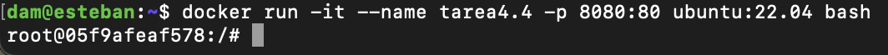

# Tarea 4
*Esteban Miguel Montes Adraz* - *2 DAM* - *SXE*

#

## 1. Utiliza la imagen de Ubuntu , tag 22 y apoyandote en esta guía sigue sus instrucciones para instalar LAMP en dicho contenedor.

Para descargarnos LAMP, vamos a seguir estas instrucciones:

1. Instalación de Apache
    * Primero actualizamos el repositorio  y descargamos apache2 con el comando ```apt``` como se muestra a continuación:
    ```
    sudo apt update

    sudo apt install -y apache2 apache2-utils
    ```

2. Instalación de MariaDB
    *  Instalamos la versión más reciente de MariaDB desde su propio repositorio con el siguiente comando:
    ```
    sudo apt install -y mariadb-server mariadb-client
    ``` 
    * Ahora, instalaremos MySQL mediante el siguiente comando
    ```
    sudo mysql_secure_installation
    ```
    * Al hacer esta instalación nos saldrá una serie de preguntas. A continuación, pondremos lo que hay que marcar en cada una:

    


3. Instalación de PHP
    * Instalamos PHP mediante este comando:
    ```
    sudo apt install -y php php-mysql libapache2-mod-php
    ```
    * Después de la instalación, reiniciamos el apacher webserver:
    ```
    sudo systemctl restart apache2
    ```

Ahora nos descargaremos la imagen de Ubuntu de esta manera:
```
docker pull ubuntu:22.04
```

Después de descargarlo creamos un contenedor y ya accederemos a él:
```
docker run -it --name ubuntu-lamp -p 8080:80 -p 3306:3306 ubuntu:22.04 bash
```

Nos debería aparecer esto:


# 
#

Ahora vamos a instalar Apache, PHP y MySQL dentro del contenedor

* Primero actualizaremos los paquetes e instalaremos Apache, luego lo podemos iniciar con los siguientes comandos:
```
apt update && apt upgrade -y

apt install apache2 -y

service apache2 start
```

* Ahora instalaremos MySQL y lo iniciaremos:
```
apt install mysql-server -y

service mysql start
```

* Por último, instalaremos PHP y reiniciaremos Apache para habilitar PHP
```
apt install php libapache2-mod-php php-mysql -y
```
En la instalación nos pedirá que introduzcamos nuestra área geográfica y nuestro huso horario, tal como indica en la foto


* Ahora reiniciaremos Apache para habilitar PHP
```
service apache2 restart
```